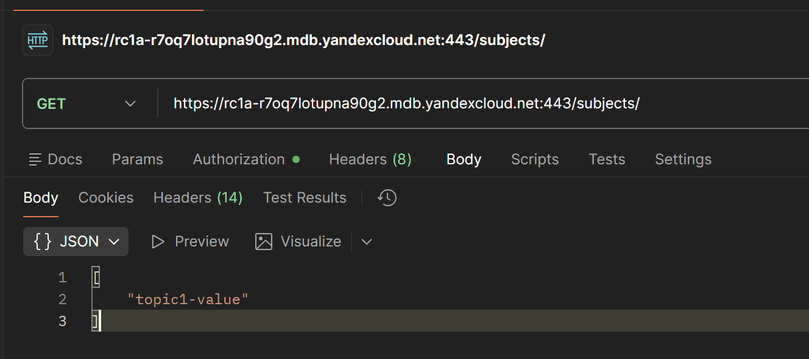
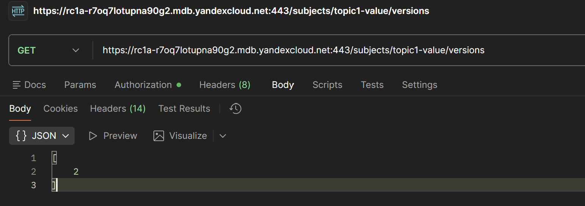
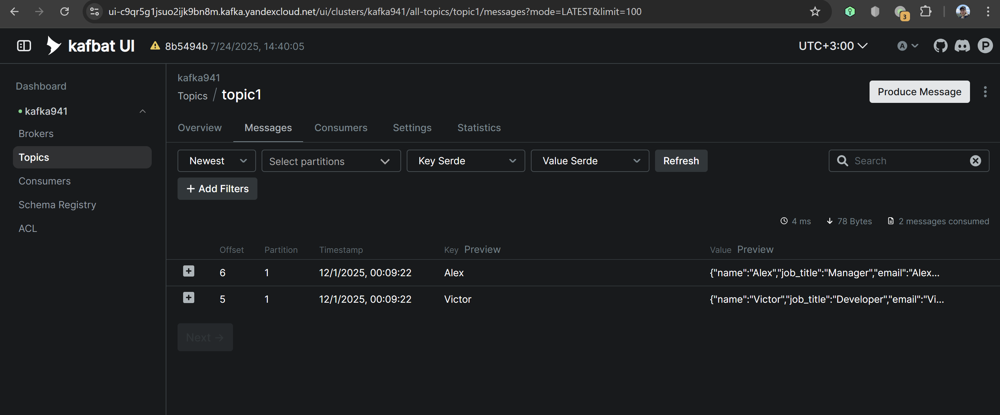
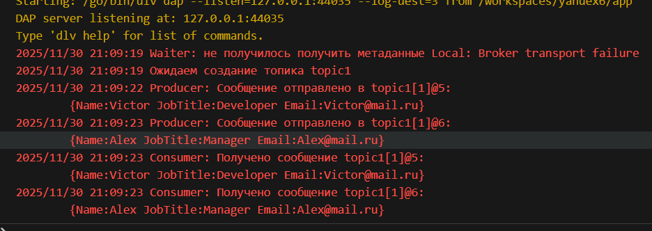
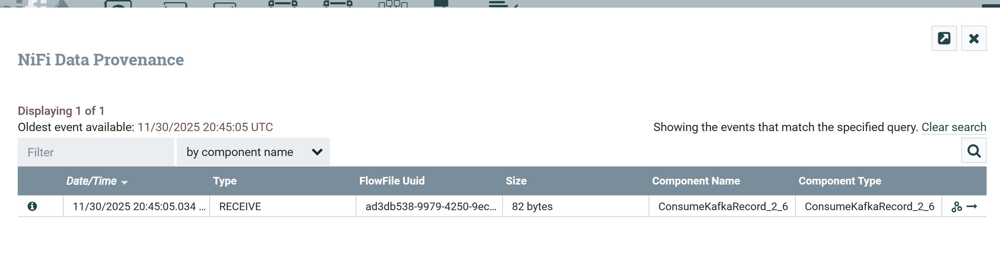

# yandex-kafka-6

## Первая часть

### Выполненные шаги:
1. Создал кластер с помощью Managed Service for Kafka. Выбрал самые бюджетные настройки (стартовый грант использовал давно)
   - Реестр схем данных: Да
   - Kafka UI: Да
   - Класс хоста: s3-c2-m8 (2 vCPU, 100% vCPU rate, 8 ГБ RAM)
   - Network SSD 10 гб 
   - Публичный доступ: Да
   - По одному брокеру в каждой из трех зон доступности (итого 3 брокера)
   - Kraft комбинированный режим (контроллер там же где и брокер)
2. Создал топик с помощью Kafka UI (Managed Service for Kafka глючил, не давал сделать 3 партиции с фактором 3 и не объяснял почему)
  [конфигурация топиков](./imgs/create_topic.png)
  С параметрами:
   - Partitions             3
   - Replication Factor     3
   - cleanup.policy	        delete
   - min.insync.replicas	2
   - segment.bytes	        1073741824
   - retention.ms	        604800000
3. В Managed Service for Kafka на вкладке пользователи создал двух пользователей `topic1_consumer` и `topic1_producer` и разделил их права на `ACCESS_ROLE_CONSUMER` и `ACCESS_ROLE_PRODUCER`

### Примечание по ресурсам
Если бы было много денег то выбрал бы:
- Хосты для каждого брокера с 64ГБ RAM и 12 core CPU 
- SSD с RAID 10
- отдельные kraft хосты с 64гб SSD, 4ГБ RAM и 4 core CPU 

### Схема





```avro
{
	"fields": [
		{
			"default": "",
			"name": "name",
			"type": "string"
		},
		{
			"default": "",
			"name": "job_title",
			"type": "string"
		},
		{
			"default": "",
			"name": "email",
			"type": "string"
		}
	],
	"name": "Person",
	"type": "record"
}
```

### Describe
```
Topic: topic1 TopicId: dXZl3dVrSJmzqSgsa-oGXg PartitionCount: 3 ReplicationFactor: 3 Configs: min.insync.replicas=2,cleanup.policy=delete,follower.replication.throttled.replicas=*,segment.bytes=1073741824,retention.ms=604800000

Topic: topic1 Partition: 0 Leader: 3 Replicas: 3,1,2 Isr: 2,1,3

Topic: topic1 Partition: 1 Leader: 1 Replicas: 1,2,3 Isr: 2,1,3

Topic: topic1 Partition: 2 Leader: 2 Replicas: 2,3,1 Isr: 2,1,3
```
### Логи




## Вторая часть

Что сделано:
- Приложение с продьюсером и консьюмером. Продьюсер публикуют сообщения используя avro схему регистри.
- Apache NiFi и шаблон, который читает сообщения из топика, десериализует его с помощью авро схемы и сохраняет результаты в .csv файлах

Как проверить:

1. Выполнить команду
```
docker compose up -d
```
2. Перейти по ссылке http://localhost:8082/nifi/ и дождаться когда страница загрузится
3. На левой части экрана найти вкладку Operate и нажать кнопку Upload Template
4. Загружаем файл [YandexPipeline.xml](./YandexPipeline.xml)
5. С верхней панели переносим (с помощью drag and drop) Template на рабочую область, выбираем YandexPipeline
6. Двойной клик на квадрат "ConsumeKafkaRecord_2_6"
7. Properties -> Value Record Reader -> 3 столбец ("Go to")
8. Для каждой строки нажимаем Enable (иконка с молнией)
9. Закрываем модальное окно
10. На каждом квадрате нажимаем ПКМ -> Start
11. Ждем появление файла в папке ./nifi_data/test

### Consumer Processor


### PutFile Processor

